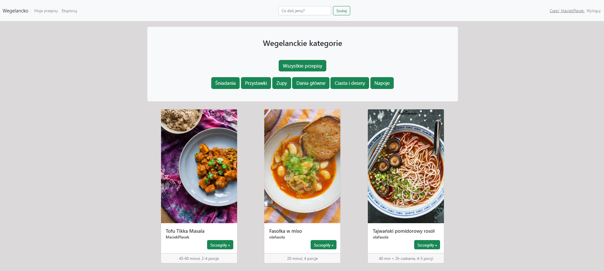

# Wegelancko

The project represents a recipe manager application. It uses MySQL database.

On the start screen there is an option to *register* and *login* to the application. On the lower part of the screen there is a Bootstrap 5 carrousel which shows three last recipes added onto the application. User can also explore the recipes without a registration.

The registered user can *add* his own recipes, *edit* and *delete* them as well as add comments to existing recipes. The user can *explore* his recipes and the recipes added by all users in the application. The user can *search* the recipe by its title on the search bar.

The project is still under development and it's missing important functionalities such as edition/deletion of the recipe by the right user, edition/deletion of comments and upgrading categories sections.

## Features

- **Registration** (function-based view in "users" app: *register*),
- **Login** (Django built-in authentication system),
- **CRUD operations** (function-based views in "recipes" app: *add_recipe*, *show_recipes*, *update_recipe*, *add_comment*; class-based view in "recipes" app: *RecipeDelete*),
- **Search recipe** (function-based view in "recipe" app: *search_recipe*),
- **Carousel with last three recipes** (function-based view in "recipe" app: *index*),
- **Adjusted Admin Page**,
- **Configured MySQL Database**,
- **All templates modified with Bootstrap 5**.
